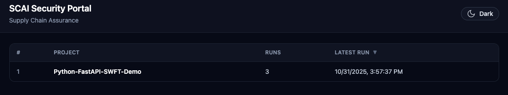
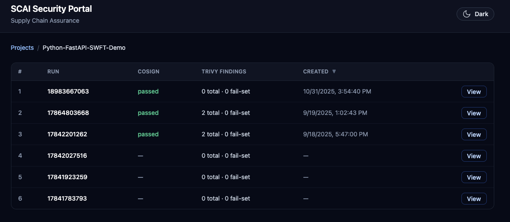
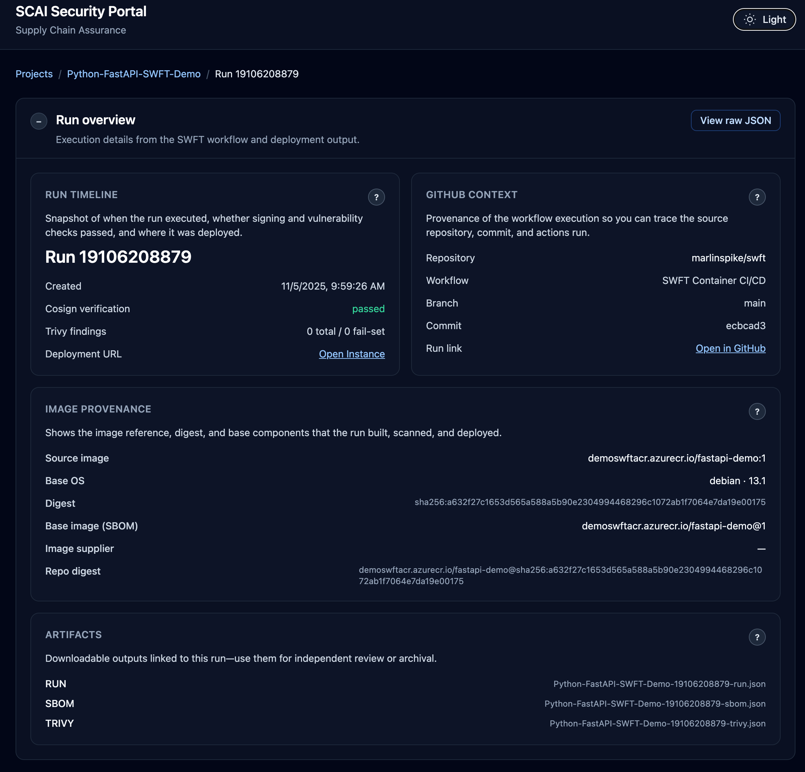
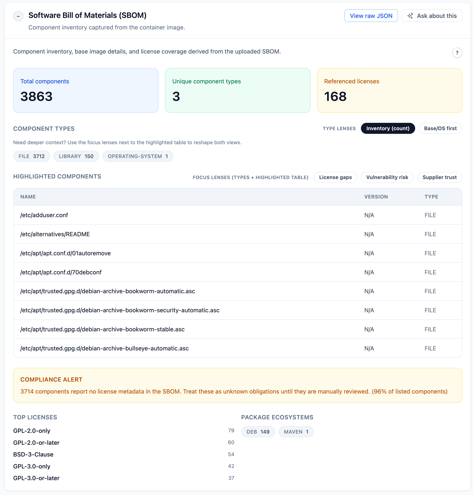
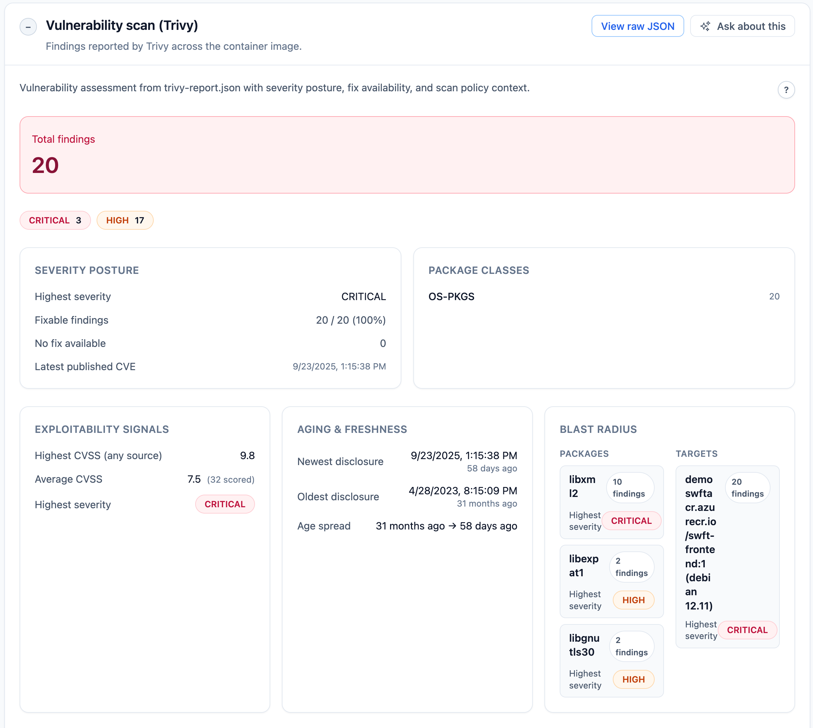
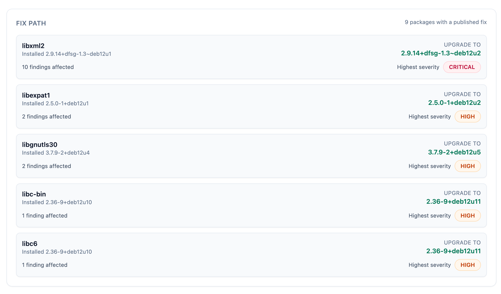
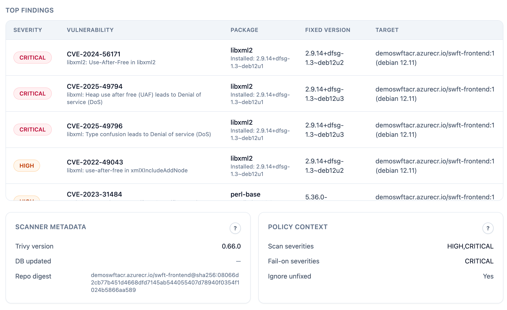
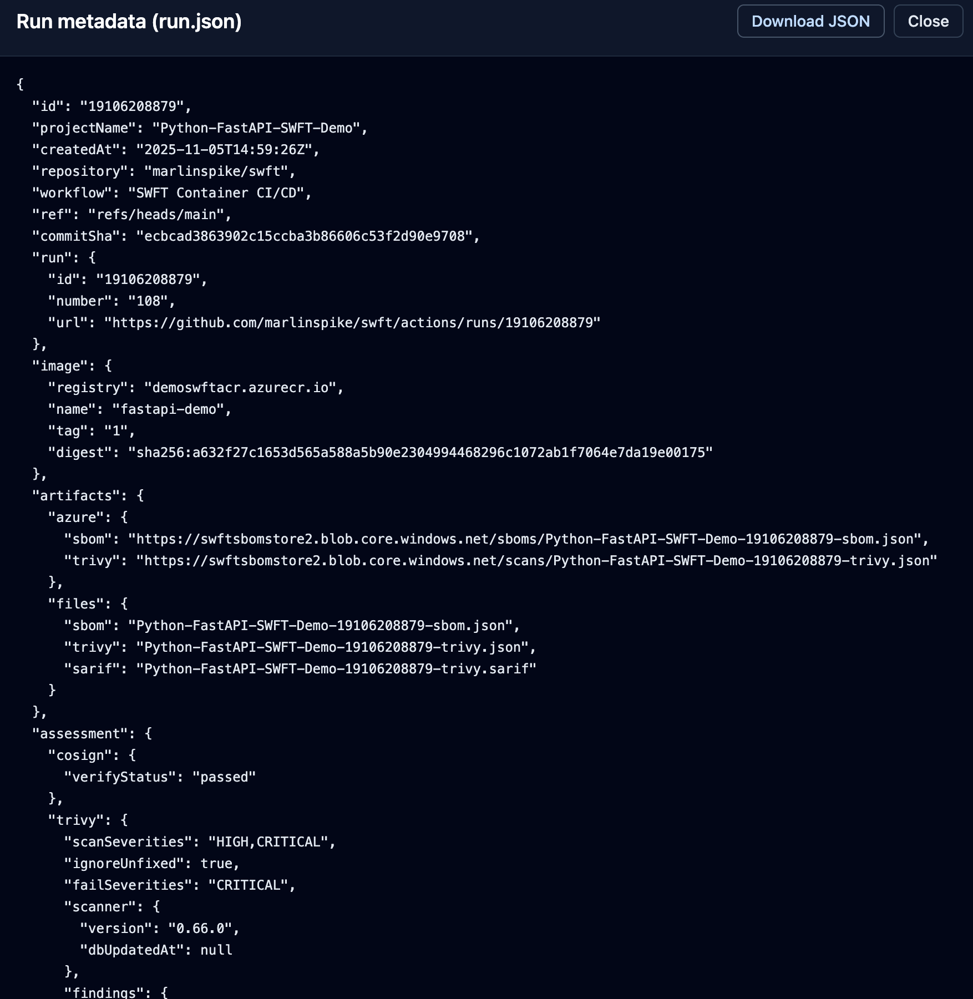
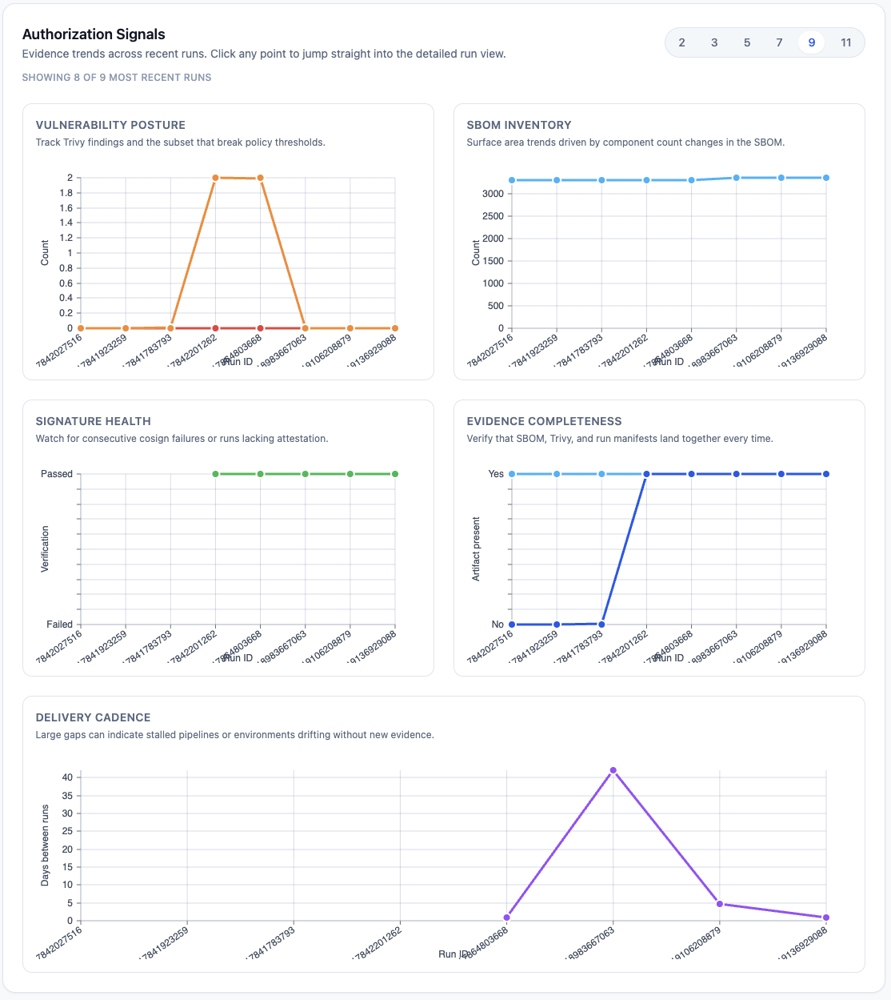

# SWFT Authorization Portal with AI Assistant

This repository hosts a supply-chain security MVP for the DoD Software FastTrack (SWFT) initiative, now paired with an AI-assisted evidence review experience. The portal follows the [DoD Enterprise DevSecOps Reference Design for Azure and GitHub](https://dodcio.defense.gov/Portals/0/Documents/Library/DoDRefDesignCloudGithub.pdf), co-developed by the DoD CIO and Microsoft (see Reuben Cleetus and Tim Meyers). That reference architecture affirms GitHub.com private organizations and repositories can support IL5 workloads when paired with the prescribed SaaS/IaC controls, giving federal, DoD, and regulated programs a sanctioned pattern to “code low, deploy high” with GitHub Enterprise at IL2 while promoting artifacts into IL4/5 environments secured by DoD Cloud IaC baselines and provisional ATOs. It outlines how SaaS toolchains, Azure Government landing zones, and CSP-managed services combine to deliver secure DevSecOps pipelines, while highlighting Authorizing Official guidance for monitoring, inheritance, and full ATO transitions aligned to IL4/5 operations. This implementation follows those patterns so Fed/DoD and regulated-industry customers can demonstrate compliant adoption with minimal tailoring while delegating evidence triage to an embedded AI colleague.

## Why This Repo and ideas matter

- **Continuous evidence, not quarterly binders.** Every container build automatically emits a signed SBOM, Trivy scan, and run manifest that the portal ingests within minutes, so Authorizing Officials can inspect living artifacts instead of chasing emailed checklists.
- **Speed with trust baked in.** Cosign signatures, policy-enforced scans, and immutable blob storage prove the image deployed to IL4/5 is exactly what passed IL2 review, making “build low, deploy high” a repeatable, auditable muscle rather than a one-off hero effort.
- **Humans decide; automation prepares.** The workflow and dashboard assemble the compliance story upfront, highlighting drift and policy violations so assessors spend time on judgment calls, not document triage.
- **Industry best-in-class SAST out of the box.** GitHub CodeQL runs alongside the pipeline, catching code weaknesses with the same static analysis engine used across Microsoft, GitHub, and open source ecosystems.
- **Low-cost by design.** The footprint leans on resources most teams already license: GitHub Enterprise private org/repo, Azure Storage, and nothing more, so programs add assurance without absorbing a new platform bill.
- **AI-native review flows.** The built-in assistant auto-loads SBOM, Trivy, and run manifest evidence (“auto-context”) so Authorizing Officials can interrogate risk data without leaving the dashboard.
- **AI-ready from day one.** Because every run lands as structured data, teams can extend the assistant with additional personas, prompt packs, or downstream automation that surfaces anomalies and recommended mitigations.
- **Single pane of glass for the enterprise.** Developers keep iterating quickly, security inherits the controls automatically, and decision-makers monitor readiness across programs from a single view, driving faster authorizations without sacrificing rigor.

It contains:

- **`backend/`** – FastAPI service that indexes pipeline artifacts (SBOM, Trivy, run metadata) directly from Azure Blob Storage.
- **`frontend/`** – React + Tailwind portal exposing dashboards for Security Control Assessors.
- **`samples/fastapi-demo/`** – Stand-alone FastAPI workload originally used to drive the GitHub Actions pipeline. This is still the case and for demo purposes, a change to a file here or a manual invocation runs the workflow, which will later be visible in the UI.
- **`.github/workflows/deploy.yml`** – SWFT-inspired pipeline that builds, signs, scans, uploads, and deploys the sample FastAPI container (`samples/fastapi-demo/`).

The workflow still produces hardened artifacts named `<project>-<run>-{sbom|trivy|run}.json`, enabling the portal to surface evidence without additional ingestion.

## Operating Footprint & Stack

- **Source control prerequisites:** A private GitHub organization and repository (as prescribed by the DoD reference design) to host workflows, CodeQL, and deployment secrets.
- **Evidence store:** A single Azure Storage account (Standard tier is sufficient) with flat containers for SBOM, Trivy, run manifests, and `app-design.md`. Local filesystem mirrors keep developer environments inexpensive.
- **Optional runtime:** Azure Container Instances, or any container host you pick, for showcasing the promoted workload.
- **Implementation stack:** FastAPI + Python on the backend, React + Vite + Tailwind on the frontend, Nivo for visualization; modern, widely adopted OSS that is easy for teams to maintain or extend.
- **Compliance database:** Azure Database for PostgreSQL (Flexible Server). The SWFT engine stores catalog pins, project boundaries, parameter values, policy telemetry, and evidence metadata there. Configure it via `SWFT_DB_*` environment variables; migrations are applied with `uv run swft store migrate`.

## Quick Start

### Prerequisites

- GitHub Enterprise private organization and/or private repository with Actions/CodeQL enabled
- Python 3.11+
- Node.js 20+ and npm
- Azure Storage account (or local artifacts extracted into a directory)

### Python workspace (uv)

This repo is managed as a uv workspace so the shared SWFT compliance package and backend install together.

```bash
# Install deps (creates .venv/ at the repo root)
uv sync

# Run CLI commands
uv run swft config show

# Start the backend API (from repo root)
uv run -- python -m uvicorn app.main:app --reload --app-dir backend --port 8000

If you previously created `backend/.venv`, remove it to avoid accidentally running the API outside the workspace.

### Backend API (FastAPI)

```bash
# assuming uv sync has already created .venv/
uv run -- python -m uvicorn app.main:app --reload --app-dir backend --port 8000
```

Copy `backend/.env.example` to `backend/.env` and fill in the values, or export them in your shell:

- `AZURE_STORAGE_ACCOUNT` or `AZURE_STORAGE_CONNECTION_STRING`
- `AZURE_STORAGE_CONTAINER_SBOMS` (default `sboms`)
- `AZURE_STORAGE_CONTAINER_SCANS` (default `scans`)
- `AZURE_STORAGE_CONTAINER_RUNS` (default `runs`)
- `AZURE_STORAGE_CONTAINER_APPDESIGN` (default `appdesign`)
- `AZURE_STORAGE_BLOB_PREFIX_DELIMITER` (default `-`)
- `AZURE_TENANT_ID`, `AZURE_CLIENT_ID`, `AZURE_CLIENT_SECRET` (service principal, optional if managed identity is available)
- `LOCAL_BLOB_ROOT` – optional filesystem directory that mirrors the Azure containers for offline development/testing

API surface:

- `GET /projects` – list projects discovered from run manifests
- `GET /projects/{project}/runs` – enumerate runs with cosign/trivy summaries
- `GET /projects/{project}/runs/{run}` – detailed run metadata + artifact descriptors
- `GET /projects/{project}/runs/{run}/artifacts/{sbom|trivy|run}` – raw artifact payload (JSON)

### Frontend Portal (React + Tailwind)

```bash
cd frontend
npm install
npm run dev # served on http://localhost:5173
```

Set `VITE_API_BASE_URL` (default `/api`) to point at the FastAPI backend. The Vite dev server proxies `/api` requests to `http://localhost:8000` by default.

The UI provides:

- Project dashboard with latest run timestamps
- Per-project run tables summarizing cosign status and Trivy finding counts
- Authorization signal board that highlights five risk lenses: vulnerability posture, SBOM inventory, signature health, artifact completeness, and delivery cadence
- Run detail views with metadata, artifact listings, and inline JSON viewers
- Light/Dark mode theme toggle with persisted preference

The authorization signals card activates once a project has at least two runs. Users can toggle between 2, 3, 5, 7, 9, or 11-run windows, and click any point to jump directly into the matching run detail. Each panel targets a question Authorizing Officials routinely ask:

1. **Vulnerability posture** – total vs. fail-set Trivy findings to expose emerging high-severity risk.
2. **SBOM inventory** – component count swings that might indicate unexpected supply chain changes.
3. **Signature health** – consecutive cosign failures or missing attestations.
4. **Evidence completeness** – quick confirmation that SBOM, Trivy, and run manifests landed together.
5. **Delivery cadence** – days between runs to spot stalled pipelines or aging evidence.

The responsive Nivo implementation honors the portal’s light/dark theme and gracefully handles sparse data sets.

#### UI Preview

| View | Description | Screenshot |
|------|-------------|------------|
| Projects | Portfolio landing page with sortable projects and latest run timestamps |  |
| Runs | Per-project run list with cosign status and Trivy totals/fail-set counts |  |
| Run overview | Dark-mode run dashboard with provenance, GitHub context, image lineage, and artifact links |  |
| SBOM lenses | Component inventory with type badges, dual lens controls (type-only vs. focus lenses), compliance alert, and license/ecosystem breakdowns |  |
| Trivy posture | Vulnerability summary with exploitability signals, aging/freshness, blast radius (packages/targets), and policy context |  |
| Fix path | Ranked remediation list showing installed vs. fixed versions, affected findings, and highest severity per package |  |
| Top findings | Expanded findings table with scanner metadata and policy context callouts |  |
| Raw JSON | Full-screen modal for run.json with inline download and citations for SBOM/Trivy artifacts |  |
| Authorization Signals | Trend board covering vulnerability posture, SBOM surface area, signature health, evidence completeness, and delivery cadence |  |
| AI Assistant | Multi-persona assistant with facet-aware context windows, model picker, and quick-start prompts |  |

---

## SWFT Assistant (Chat Experience)

An embedded assistant now travels with every run detail page. It auto-loads the run manifest plus facet-specific evidence (“auto-context”) so assessors can ask “What broke in this Trivy scan?” and immediately receive grounded, citation-rich answers. Keyboard shortcuts (`⌘ + Enter` / `Ctrl + Enter`) fire off questions without leaving the keyboard.

### Configure credentials

1. Copy `backend/.env.example` to `backend/.env`.
2. Set the provider and credentials:
   - For OpenAI:
     ```
     OPENAI_PROVIDER=openai
     OPENAI_API_KEY=sk-...
     OPENAI_ORG_ID=<optional>
     ```
   - For Azure OpenAI:
     ```
     OPENAI_PROVIDER=azure
     OPENAI_API_KEY=<azure-openai-key>
     OPENAI_API_BASE=https://<resource>.openai.azure.com/
     OPENAI_API_VERSION=2024-08-01-preview   # match your deployment
     ```
3. Keep `ASSISTANT_MODEL_CONFIG_PATH` pointing at the model catalogue you maintain (default is `backend/app/assistant/model_config.json`).

Restart the FastAPI server after editing the environment so the assistant reloads credentials.

### Customise the model catalogue

`backend/app/assistant/model_config.json` describes every model the UI can select. Each entry needs:

- A key (e.g. `azure-gpt-4o-mini`) that the frontend presents in the model dropdown.
- For Azure entries, a `deployment` that matches the deployment name in your Azure OpenAI resource.
- For OpenAI entries, a `model` identifier such as `gpt-4o` or `gpt-4o-mini`.
- Optional `response_format` hints (set to `"json"` for structured replies).
- Optional `total_context_window`, `max_input_tokens`, and `max_output_tokens`. If omitted, the backend falls back to sensible defaults (see table in this section), and it passes `max_output_tokens` to the Responses API so outputs stay within the configured budget.

You can add or remove models at any time; the assistant configuration endpoint reads the file on startup so the UI stays in sync.

| Model family | Total context | Max output | Implied max input |
|--------------|---------------|------------|-------------------|
| GPT-4o / GPT-4.1 | 128k tokens | 4k tokens | ~124k tokens |
| GPT-4o-mini | 128k tokens | 16,384 tokens | ~111,616 tokens |
| GPT-5 / GPT-5-mini / GPT-5-nano | 400k tokens | 128k tokens | ~272k tokens |

Use these defaults unless your deployment advertises tighter limits.

### Personas & auto-context

- **Personas** (`Security Assessor`, `Compliance Officer`, `DevOps Engineer`, `Software Developer`) live in `backend/app/assistant/prompts.py`. Tweak or extend the persona copy to steer tone and priorities.
- **Auto-context** automatically attaches evidence to each question:
  - The run manifest is always provided.
  - SBOM and Trivy JSON snippets are included when the relevant facet (or the `General` facet) is selected.
  - `app-design.md` is injected in full so architecture decisions accompany every response.
  - Large artefacts are trimmed client-side to keep requests within model limits; the assistant labels truncated sections so users know when to fetch the raw JSON modal.
- **Schemas** in `backend/app/assistant/schema/` define the contracts the assistant cites. They supplement the raw artefacts and keep the model grounded on field names and semantics.

### app-design.md (Shared knowledge base)

- Developers should capture system intent, data flows, control mappings, and operational runbooks in `app-design.md`. See the template at the repo root for the recommended structure and tables.
- The assistant includes every section of `app-design.md` in its system prompt, so AOs can ask architectural or compliance questions with full context.
- Update the file whenever architecture changes, new environments come online, or AO guidance evolves. A short change log at the bottom helps the assistant highlight recent updates.
- Include Mermaid diagrams which can render visually and are understanded by the assistant for richer context.

### API & streaming endpoints

- `POST /assistant/chat` - synchronous responses, returning `ChatResponse`.
- `POST /assistant/chat/stream` - newline-delimited JSON stream with `metadata`, incremental `delta`, optional `error`, and `final` messages. The frontend uses this path for real-time typing indicators.
- `GET /assistant/config` - returns the active provider, models, persona list, available facets, and whether streaming is enabled.

Both endpoints accept `ChatRequest`, including optional `context` maps if you want to send custom artefacts from another client.

### Sample FastAPI Workload

The original workload lives under `samples/fastapi-demo/`.

```bash
cd samples/fastapi-demo
pip install -r requirements.txt
uvicorn app.main:app --reload --port 8080
```

A Docker image for the demo can still be built with `docker build -t swft-demo samples/fastapi-demo`.

## CI/CD Workflow Highlights

Workflow file: `.github/workflows/deploy.yml`

## Compliance Authoring Engine CLI (preview)

This repo now ships a Typer-based CLI under the `swft` entrypoint. The CLI will ingest authoritative control catalogs, evidence, and Azure Policy snapshots in later steps; for now it provides configuration inspection plus the Azure Database for PostgreSQL migration runner.

### Environment configuration

1. Copy `.env.example` to `.env` (already gitignored).
2. Provide the required Azure PostgreSQL details:
   - `SWFT_DB_HOST`: fully qualified Flexible Server host (e.g., `swft-db.postgres.database.azure.com`)
   - `SWFT_DB_NAME`: logical database containing the compliance schema
   - `SWFT_DB_USER`: Microsoft Entra principal (preferred) or database login
   - `SWFT_DB_AUTH`: `entra` for token auth or `password` for traditional credentials
   - `SWFT_DB_PASSWORD`: only when `SWFT_DB_AUTH=password`
   - Optional overrides: `SWFT_DB_AAD_SCOPE`, `SWFT_DB_PORT`, `SWFT_DB_TIMEOUT`
3. (Optional) Set `SWFT_HOME`, `SWFT_STORE`, `SWFT_PINNED`, and `SWFT_OUTPUTS` to control where the CLI writes cache files; defaults live under `~/.swft/`.

You can mirror the same values in `swft.toml` if you prefer checked-in, non-secret defaults. Environment variables and `.env` always take precedence.

### First commands

```bash
# Show the resolved configuration (after filling .env)
uv run swft config show

# Apply or verify the database schema
uv run swft store migrate

# Confirm connectivity and review applied migrations
uv run swft store doctor

# Pin the NIST catalog + FedRAMP baseline
uv run swft oscal sync-catalog \
  --catalog /path/to/SP800-53-catalog.json \
  --baseline /path/to/fedramp-high-profile.json \
  --name fedramp-high

# Or have the CLI download straight from NIST (no manual files required)
# Run once per baseline you plan to support so every project can select it later.
uv run swft oscal sync-nist-sp80053 --baseline low       --version v1.3.0 --format json
uv run swft oscal sync-nist-sp80053 --baseline moderate  --version v1.3.0 --format json
uv run swft oscal sync-nist-sp80053 --baseline high      --version v1.3.0 --format json
uv run swft oscal sync-nist-sp80053 --baseline privacy   --version v1.3.0 --format json
# (Repeat for other impact levels or updated versions as needed.)

Each command downloads the SP 800-53 Rev5 catalog plus the selected baseline profile, pins the files, and imports them into PostgreSQL so the workspace/control-parameter UI can enumerate the controls for every project without manual uploads.

Set `SWFT_OSCAL_BASE_URL` in `.env` if you mirror the NIST repo (the template must keep `{version}`, `{fmt}`, `{filename}` placeholders); the downloader will pull from your custom endpoint automatically.
Similarly, `SWFT_AZURE_POLICY_BASE_URL` lets you pin Azure Policy definitions to a specific Git commit or a private mirror.

# Define a project boundary
uv run swft project init \
  --name swft-demo \
  --services "azure-container-instances, key-vault" \
  --regions "usgov-virginia" \
  --boundary-file docs/swft-boundary.md

# Review and set a parameter value
uv run swft control list-params --control AC-2 --project swft-demo
uv run swft control set-param \
  --project swft-demo \
  --control AC-2 \
  --param ac-2_prm_1 \
  --value "every 30 days"

# Attach pipeline evidence
uv run swft evidence add sbom \
  --project swft-demo \
  --run-id github-run-123 \
  --file evidence/sbom.cyclonedx.json

uv run swft evidence add trivy \
  --project swft-demo \
  --run-id github-run-123 \
  --file evidence/trivy.json \
  --artifact my-image:latest

uv run swft evidence add signature \
  --project swft-demo \
  --run-id github-run-123 \
  --file evidence/cosign.json \
  --digest sha256:d34db33f \
  --verified true

# Import Azure Policy mappings and telemetry
uv run swft policy import \
  --file downloads/nist-sp-800-53-r5-initiative.json \
  --name nist-sp-800-53-r5 \
  --scope gov

uv run swft policy import-states \
  --file snapshots/policy-states.json \
  --initiative nist-sp-800-53-r5 \
  --scope gov

# Or pull Azure Policy set definitions straight from GitHub
uv run swft policy import \
  --file <(curl -s https://raw.githubusercontent.com/Azure/azure-policy/master/built-in-policies/policySetDefinitions/Regulatory%20Compliance/NIST_SP_800-53_R5.json) \
  --name nist-sp-800-53-r5 \
  --scope gov
```

The CLI automatically creates local working directories and uses Azure AD token authentication when configured with `SWFT_DB_AUTH=entra`.

`swft oscal sync-catalog` copies the supplied OSCAL catalog/profile into `~/.swft/pinned/`, records the hashes in the version registry, and normalizes control metadata inside the Azure Postgres store. Project, parameter, evidence, and `policy` commands persist their data in Azure Postgres so SSP/POA&M exports inherit consistent boundaries, telemetry, and artifact provenance. Azure Policy data is always tagged as **partial** evidence; you still need customer-side procedures to satisfy the control. Re-run the sync/import commands whenever NIST, FedRAMP, or Microsoft publish refreshed content.

### Lookup data (Azure services + regions)

The SWFT workspace enforces curated Azure vocabularies located under `lookup/`:

- `lookup/azure_services.csv` – canonical Azure service names accepted in project boundaries (e.g., `App Service`, `Azure SQL Database`, `Azure Arc-enabled Kubernetes`). This list feeds the CLI, backend validation, and the UI’s typeahead control. Update it whenever Microsoft publishes new services.
- `lookup/azure_regions.csv` – official Azure region names (including Gov/DoD). The project boundary UI exposes the same typeahead/tokens experience, and the backend only accepts regions present in this file.

Both lookup files are copied into the backend container at build time. You can override them by setting `SWFT_AZURE_SERVICES_FILE` or `SWFT_AZURE_REGIONS_FILE` to alternate CSV paths.

### SWFT Workspace (web UI)

- Navigate to `/swft` from the portal header. The landing page lists every repo discovered via run manifests; the SWFT workspace URL is `/swft/<org>/<repo>` and shares the same project ID the dashboard already uses.
- **Project Boundary**: The first card lets Dev teams create/update the project record that lives in Azure PostgreSQL:
  - Select Azure services and regions via tokenized typeahead pickers (driven by the lookup CSVs). Only catalog-approved values are accepted and they sync 1:1 with backend validation.
  - Provide the boundary narrative. Clicking **Create Project** (or **Update Boundary**) persists everything through `PUT /swft/<project>/project`.
- **Authoritative inputs**: Upload OSCAL catalog/baseline files and Azure Policy initiatives/states directly in the browser. The backend writes them to the pinned directory, registers hashes in the version registry, and normalizes mappings.
  - A built-in **Azure Policy catalog** card lets you select common regulatory initiatives (NIST, FedRAMP, ISO, etc.). The portal automatically fetches the JSON from Microsoft's GitHub repo (`SWFT_AZURE_POLICY_BASE_URL` controls the source) and ingests it—no manual download required. You can still upload custom initiatives and policy-state snapshots when needed.
- **Evidence uploads**: Attach CycloneDX SBOMs, Trivy reports, and Cosign verification JSON to any run ID. Each upload writes the artifact metadata to Azure Postgres, linking it to the project and run.
- **Control parameters**: Use the UI to inspect/set NIST control parameters, prompting Dev teams for values required to export an SSP. Every change keeps the implemented requirement scaffolding in sync.

Authorizing Officials can view the same workspace to monitor progress, review telemetry, and trigger SSP/POA&M exports in future iterations—no CLI access required. All workspace actions hit the new `/api/swft/...` endpoints, which share the compliance engine with the CLI, so everything stays deterministic regardless of interface.

On push to `main` or manual dispatch the pipeline:

1. Builds and pushes the container image to ACR (using `samples/fastapi-demo/Dockerfile`).
2. Pulls the tag and captures the immutable digest.
3. Signs the digest with Cosign using keys supplied via GitHub secrets.
4. Generates a CycloneDX SBOM (Syft/Anchore).
5. Runs Trivy twice (JSON + SARIF) and enforces optional severity policy.
6. Uploads SARIF to GitHub code scanning, where CodeQL pairs with container results for best-in-class static analysis coverage.
7. Optionally uploads SBOM, Trivy JSON, run manifest, and `app-design.md` to Azure Blob Storage using flat names `<project>-<run>-*`.
8. Deploys the image to Azure Container Instances and records the public endpoint.
9. Publishes artifacts back to GitHub Actions for traceability.

Required secrets:

- `ACR_LOGIN_SERVER`, `ACR_USERNAME`, `ACR_PASSWORD`, `IMAGE_TAG`
- `AZURE_CREDENTIALS` (for `azure/login@v2`)
- `AZURE_STORAGE_ACCOUNT`
- `COSIGN_KEY_B64`, `COSIGN_PUB_KEY_B64`

Optional variables:

- `PROJECT_NAME`, `UPLOAD_TO_AZURE`, `UPLOAD_ARTIFACTS`, `FAIL_ON_TRIVY`

Manual dispatch inputs mirror the optional variables and expose per-run overrides (`trivy_config`, `fail_on_cosign_verify`, etc.).

Outputs persisted per run:

- `sbom.cyclonedx.json`
- `trivy-report.json`
- `trivy-results.sarif`
- `run.json` (portal metadata contract)
- `app-design.md` (architecture context per run)
- `aci-endpoint.txt`

## CodeQL Static Analysis

Enable GitHub code scanning to add static application security testing (SAST) alongside the container pipeline:

1. In GitHub, open `Security → Code scanning alerts → Set up code scanning → CodeQL analysis` and accept the starter pull request that adds `.github/workflows/codeql.yml`.
2. Confirm the generated `languages` matrix covers this repo; set it to `["python", "javascript-typescript"]` so both the FastAPI backend and React frontend are analyzed. You can add or remove languages at any time.
3. If `autobuild` fails, replace it with explicit build steps. A typical customization looks like:

   ```yaml
   - run: |
       python -m venv .venv && source .venv/bin/activate
       pip install -e backend[dev]
   - run: |
       cd frontend
       npm ci
   - uses: github/codeql-action/analyze@v3
   ```

   Keep dependencies lightweight; install only what the analyzer needs to understand imports/types.


## Developer Tooling

A helper `Makefile` is provided:

```bash
make backend-install   # pip install backend
make backend-test      # pytest suite
make backend-serve     # uvicorn --reload
make frontend-install  # npm install
make frontend-dev      # vite dev server
make frontend-build    # production bundle
make lint              # run ruff on backend
```


## Testing

Backend unit tests use the `LOCAL_BLOB_ROOT` pathway to exercise blob parsing without Azure dependencies:

```bash
cd backend
python -m pytest
```

Frontend tests are not yet wired; add Playwright or Vitest as needs evolve.

## Future Direction

See `dev-plan.md` for phased roadmap details covering integration work, operations hardening, and long-term feature backlog (AI-assisted insights, reporting, additional artifact ingestion, and more). Contributions can target the next open items in Phases 3–5 to extend portal capabilities.

## License

MIT License
