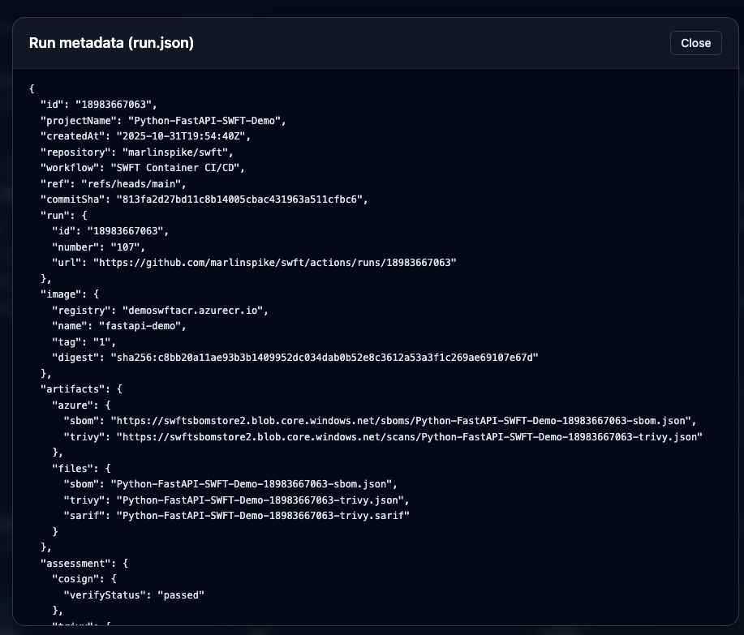

# SWFT Portal Monorepo

This repository hosts a supply-chain security MVP for the DoD Software FastTrack (SWFT) initiative. It is built on the [DoD Enterprise DevSecOps Reference Design for Azure and GitHub](https://dodcio.defense.gov/Portals/0/Documents/Library/DoDRefDesignCloudGithub.pdf), co-developed by the DoD CIO and Microsoft. That reference architecture affirms GitHub.com private organizations and repositories can support IL5 workloads when paired with the prescribed SaaS/IaC controls, giving federal, DoD, and regulated programs a sanctioned pattern to “code low, deploy high” with GitHub Enterprise at IL2 while promoting artifacts into IL4/5 environments secured by DoD Cloud IaC baselines and provisional ATOs. It outlines how SaaS toolchains, Azure Government landing zones, and CSP-managed services combine to deliver secure DevSecOps pipelines, while highlighting Authorizing Official guidance for monitoring, inheritance, and full ATO transitions aligned to IL4/5 operations. This implementation follows those patterns so Fed/DoD and regulated-industry customers can demonstrate compliant adoption with minimal tailoring.

It contains:

- **`backend/`** – FastAPI service that indexes pipeline artifacts (SBOM, Trivy, run metadata) directly from Azure Blob Storage.
- **`frontend/`** – React + Tailwind portal exposing dashboards for Security Control Assessors.
- **`samples/fastapi-demo/`** – Stand-alone FastAPI workload originally used to drive the GitHub Actions pipeline. This is still the case and for demo purposes, a change to a file here or a manual invocation runs the workflow, which will later be visible in the UI.
- **`.github/workflows/deploy.yml`** – SWFT-inspired pipeline that builds, signs, scans, uploads, and deploys the sample FastAPI container (`samples/fastapi-demo/`).

The workflow still produces hardened artifacts named `<project>-<run>-{sbom|trivy|run}.json`, enabling the portal to surface evidence without additional ingestion.

## Quick Start

### Prerequisites

- Python 3.11+
- Node.js 20+ and npm
- Azure Storage account (or local artifacts extracted into a directory)

### Backend API (FastAPI)

```bash
# Install deps
cd backend
python -m venv .venv
source .venv/bin/activate
pip install -e .[dev]

# Start API
uvicorn app.main:app --reload --port 8000
```

Copy `backend/.env.example` to `backend/.env` and fill in the values, or export them in your shell:

- `AZURE_STORAGE_ACCOUNT` or `AZURE_STORAGE_CONNECTION_STRING`
- `AZURE_STORAGE_CONTAINER_SBOMS` (default `sboms`)
- `AZURE_STORAGE_CONTAINER_SCANS` (default `scans`)
- `AZURE_STORAGE_CONTAINER_RUNS` (default `runs`)
- `AZURE_STORAGE_BLOB_PREFIX_DELIMITER` (default `-`)
- `AZURE_TENANT_ID`, `AZURE_CLIENT_ID`, `AZURE_CLIENT_SECRET` (service principal, optional if managed identity is available)
- `LOCAL_BLOB_ROOT` – optional filesystem directory that mirrors the Azure containers for offline development/testing

API surface:

- `GET /projects` – list projects discovered from run manifests
- `GET /projects/{project}/runs` – enumerate runs with cosign/trivy summaries
- `GET /projects/{project}/runs/{run}` – detailed run metadata + artifact descriptors
- `GET /projects/{project}/runs/{run}/artifacts/{sbom|trivy|run}` – raw artifact payload (JSON)

### Frontend Portal (React + Tailwind)

```bash
cd frontend
npm install
npm run dev # served on http://localhost:5173
```

Set `VITE_API_BASE_URL` (default `/api`) to point at the FastAPI backend. The Vite dev server proxies `/api` requests to `http://localhost:8000` by default.

The UI provides:

- Project dashboard with latest run timestamps
- Per-project run tables summarizing cosign status and Trivy finding counts
- Run detail views with metadata, artifact listings, and inline JSON viewers
- Light/Dark mode theme toggle with persisted preference

#### UI Preview

| View | Description | Screenshot |
|------|-------------|------------|
| Projects | Numbered list of projects with sortable columns |  |
| Runs | Workflow runs for a selected project |  |
| Dashboard | Detailed run dashboard summarising metadata, SBOM, and Trivy results |  |
| Raw JSON | Modal viewer for raw artifact payloads (run, SBOM, Trivy) |  |
| Vulnerability Scan | Trivy severity summary and ranked findings |  |
| Modal JSON Download | Raw JSON viewer with built-in download action |  |

### Sample FastAPI Workload

The original workload lives under `samples/fastapi-demo/`.

```bash
cd samples/fastapi-demo
pip install -r requirements.txt
uvicorn app.main:app --reload --port 8080
```

A Docker image for the demo can still be built with `docker build -t swft-demo samples/fastapi-demo`.

## CI/CD Workflow Highlights

Workflow file: `.github/workflows/deploy.yml`

On push to `main` or manual dispatch the pipeline:

1. Builds and pushes the container image to ACR (using `samples/fastapi-demo/Dockerfile`).
2. Pulls the tag and captures the immutable digest.
3. Signs the digest with Cosign using keys supplied via GitHub secrets.
4. Generates a CycloneDX SBOM (Syft/Anchore).
5. Runs Trivy twice (JSON + SARIF) and enforces optional severity policy.
6. Uploads SARIF to GitHub code scanning.
7. Optionally uploads SBOM, Trivy JSON, and run manifest to Azure Blob Storage using flat names `<project>-<run>-*.json`.
8. Deploys the image to Azure Container Instances and records the public endpoint.
9. Publishes artifacts back to GitHub Actions for traceability.

Required secrets:

- `ACR_LOGIN_SERVER`, `ACR_USERNAME`, `ACR_PASSWORD`, `IMAGE_TAG`
- `AZURE_CREDENTIALS` (for `azure/login@v2`)
- `AZURE_STORAGE_ACCOUNT`
- `COSIGN_KEY_B64`, `COSIGN_PUB_KEY_B64`

Optional variables:

- `PROJECT_NAME`, `UPLOAD_TO_AZURE`, `UPLOAD_ARTIFACTS`, `FAIL_ON_TRIVY`

Manual dispatch inputs mirror the optional variables and expose per-run overrides (`trivy_config`, `fail_on_cosign_verify`, etc.).

Outputs persisted per run:

- `sbom.cyclonedx.json`
- `trivy-report.json`
- `trivy-results.sarif`
- `run.json` (portal metadata contract)
- `aci-endpoint.txt`

## Developer Tooling

A helper `Makefile` is provided:

```bash
make backend-install   # pip install backend
make backend-test      # pytest suite
make backend-serve     # uvicorn --reload
make frontend-install  # npm install
make frontend-dev      # vite dev server
make frontend-build    # production bundle
make lint              # run ruff on backend
```


## Testing

Backend unit tests use the `LOCAL_BLOB_ROOT` pathway to exercise blob parsing without Azure dependencies:

```bash
cd backend
python -m pytest
```

Frontend tests are not yet wired; add Playwright or Vitest as needs evolve.

## Future Direction

See `dev-plan.md` for phased roadmap details covering integration work, operations hardening, and long-term feature backlog (AI-assisted insights, reporting, additional artifact ingestion, and more). Contributions can target the next open items in Phases 3–5 to extend portal capabilities.

## License

MIT License
