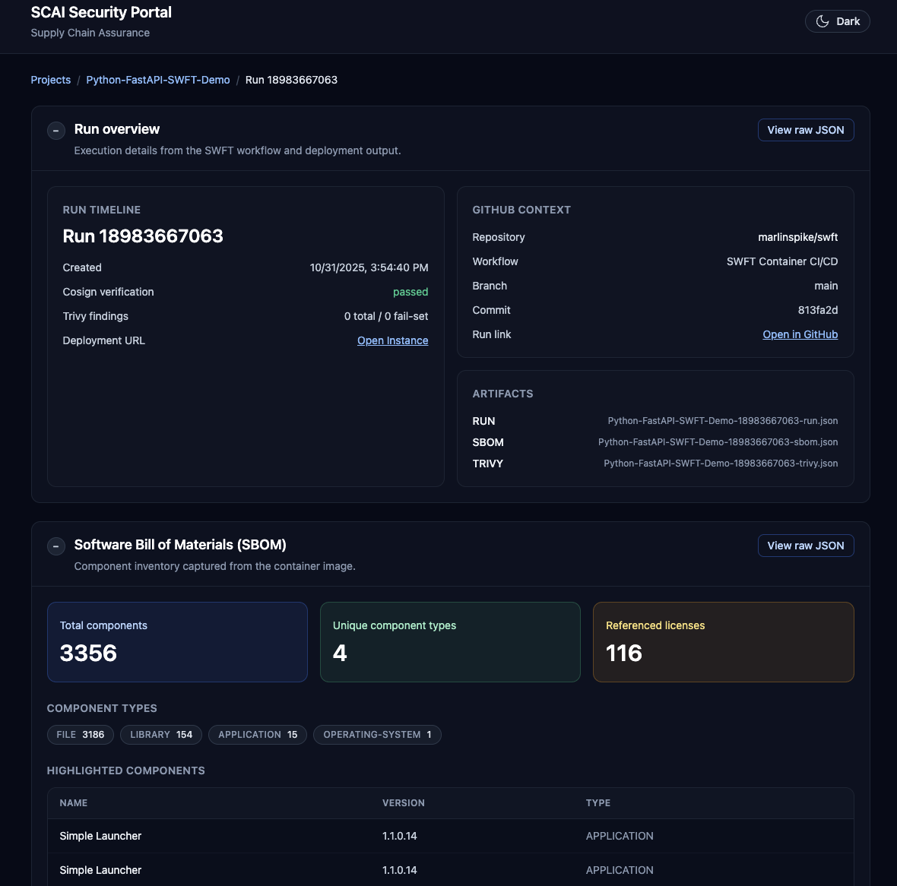

# SWFT Authorization Portal

This repository hosts a supply-chain security MVP for the DoD Software FastTrack (SWFT) initiative. It is built on the [DoD Enterprise DevSecOps Reference Design for Azure and GitHub](https://dodcio.defense.gov/Portals/0/Documents/Library/DoDRefDesignCloudGithub.pdf), co-developed by the DoD CIO and Microsoft (see Reuben Cleetus and Tim Meyers). That reference architecture affirms GitHub.com private organizations and repositories can support IL5 workloads when paired with the prescribed SaaS/IaC controls, giving federal, DoD, and regulated programs a sanctioned pattern to “code low, deploy high” with GitHub Enterprise at IL2 while promoting artifacts into IL4/5 environments secured by DoD Cloud IaC baselines and provisional ATOs. It outlines how SaaS toolchains, Azure Government landing zones, and CSP-managed services combine to deliver secure DevSecOps pipelines, while highlighting Authorizing Official guidance for monitoring, inheritance, and full ATO transitions aligned to IL4/5 operations. This implementation follows those patterns so Fed/DoD and regulated-industry customers can demonstrate compliant adoption with minimal tailoring.

## Why This Repo and ideas matter

- **Continuous evidence, not quarterly binders.** Every container build automatically emits a signed SBOM, Trivy scan, and run manifest that the portal ingests within minutes, so Authorizing Officials can inspect living artifacts instead of chasing emailed checklists.
- **Speed with trust baked in.** Cosign signatures, policy-enforced scans, and immutable blob storage prove the image deployed to IL4/5 is exactly what passed IL2 review—making “build low, deploy high” a repeatable, auditable muscle rather than a one-off hero effort.
- **Humans decide; automation prepares.** The workflow and dashboard assemble the compliance story upfront, highlighting drift and policy violations so assessors spend time on judgment calls, not document triage.
- **Industry best-in-class SAST out of the box.** GitHub CodeQL runs alongside the pipeline, catching code weaknesses with the same static analysis engine used across Microsoft, GitHub, and open source ecosystems.
- **AI-ready from day one.** Because every run lands as structured data, we can layer assistants that summarize large reports, surface anomalies, or recommend mitigations—letting analysts leverage AI where it amplifies mission outcomes.
- **Single pane of glass for the enterprise.** Developers keep iterating quickly, security inherits the controls automatically, and decision-makers monitor readiness across programs from a single view, driving faster authorizations without sacrificing rigor.

It contains:

- **`backend/`** – FastAPI service that indexes pipeline artifacts (SBOM, Trivy, run metadata) directly from Azure Blob Storage.
- **`frontend/`** – React + Tailwind portal exposing dashboards for Security Control Assessors.
- **`samples/fastapi-demo/`** – Stand-alone FastAPI workload originally used to drive the GitHub Actions pipeline. This is still the case and for demo purposes, a change to a file here or a manual invocation runs the workflow, which will later be visible in the UI.
- **`.github/workflows/deploy.yml`** – SWFT-inspired pipeline that builds, signs, scans, uploads, and deploys the sample FastAPI container (`samples/fastapi-demo/`).

The workflow still produces hardened artifacts named `<project>-<run>-{sbom|trivy|run}.json`, enabling the portal to surface evidence without additional ingestion.

## Quick Start

### Prerequisites

- Python 3.11+
- Node.js 20+ and npm
- Azure Storage account (or local artifacts extracted into a directory)

### Backend API (FastAPI)

```bash
# Install deps
cd backend
python -m venv .venv
source .venv/bin/activate
pip install -e .[dev]

# Start API
uvicorn app.main:app --reload --port 8000
```

Copy `backend/.env.example` to `backend/.env` and fill in the values, or export them in your shell:

- `AZURE_STORAGE_ACCOUNT` or `AZURE_STORAGE_CONNECTION_STRING`
- `AZURE_STORAGE_CONTAINER_SBOMS` (default `sboms`)
- `AZURE_STORAGE_CONTAINER_SCANS` (default `scans`)
- `AZURE_STORAGE_CONTAINER_RUNS` (default `runs`)
- `AZURE_STORAGE_BLOB_PREFIX_DELIMITER` (default `-`)
- `AZURE_TENANT_ID`, `AZURE_CLIENT_ID`, `AZURE_CLIENT_SECRET` (service principal, optional if managed identity is available)
- `LOCAL_BLOB_ROOT` – optional filesystem directory that mirrors the Azure containers for offline development/testing

API surface:

- `GET /projects` – list projects discovered from run manifests
- `GET /projects/{project}/runs` – enumerate runs with cosign/trivy summaries
- `GET /projects/{project}/runs/{run}` – detailed run metadata + artifact descriptors
- `GET /projects/{project}/runs/{run}/artifacts/{sbom|trivy|run}` – raw artifact payload (JSON)

### Frontend Portal (React + Tailwind)

```bash
cd frontend
npm install
npm run dev # served on http://localhost:5173
```

Set `VITE_API_BASE_URL` (default `/api`) to point at the FastAPI backend. The Vite dev server proxies `/api` requests to `http://localhost:8000` by default.

The UI provides:

- Project dashboard with latest run timestamps
- Per-project run tables summarizing cosign status and Trivy finding counts
- Authorization signal board that highlights five risk lenses: vulnerability posture, SBOM inventory, signature health, artifact completeness, and delivery cadence
- Run detail views with metadata, artifact listings, and inline JSON viewers
- Light/Dark mode theme toggle with persisted preference

The authorization signals card activates once a project has at least two runs. Users can toggle between 2, 3, 5, 7, 9, or 11-run windows, and click any point to jump directly into the matching run detail. Each panel targets a question Authorizing Officials routinely ask:

1. **Vulnerability posture** – total vs. fail-set Trivy findings to expose emerging high-severity risk.
2. **SBOM inventory** – component count swings that might indicate unexpected supply chain changes.
3. **Signature health** – consecutive cosign failures or missing attestations.
4. **Evidence completeness** – quick confirmation that SBOM, Trivy, and run manifests landed together.
5. **Delivery cadence** – days between runs to spot stalled pipelines or aging evidence.

The responsive Nivo implementation honors the portal’s light/dark theme and gracefully handles sparse data sets.

#### UI Preview

| View | Description | Screenshot |
|------|-------------|------------|
| Projects | Numbered list of projects with sortable columns |  |
| Runs | Workflow runs for a selected project |  |
| Dashboard | Detailed run dashboard summarising metadata, SBOM, and Trivy results |  |
| Raw JSON | Modal viewer for raw artifact payloads (run, SBOM, Trivy) |  |
| Vulnerability Scan | Trivy severity summary and ranked findings |  |
| Modal JSON Download | Raw JSON viewer with built-in download action |  |
| Authorization Signals | Multi-panel chart showing risk posture, SBOM, cosign, evidence completeness, and cadence |  |

### Sample FastAPI Workload

The original workload lives under `samples/fastapi-demo/`.

```bash
cd samples/fastapi-demo
pip install -r requirements.txt
uvicorn app.main:app --reload --port 8080
```

A Docker image for the demo can still be built with `docker build -t swft-demo samples/fastapi-demo`.

## CI/CD Workflow Highlights

Workflow file: `.github/workflows/deploy.yml`

On push to `main` or manual dispatch the pipeline:

1. Builds and pushes the container image to ACR (using `samples/fastapi-demo/Dockerfile`).
2. Pulls the tag and captures the immutable digest.
3. Signs the digest with Cosign using keys supplied via GitHub secrets.
4. Generates a CycloneDX SBOM (Syft/Anchore).
5. Runs Trivy twice (JSON + SARIF) and enforces optional severity policy.
6. Uploads SARIF to GitHub code scanning, where CodeQL pairs with container results for best-in-class static analysis coverage.
7. Optionally uploads SBOM, Trivy JSON, and run manifest to Azure Blob Storage using flat names `<project>-<run>-*.json`.
8. Deploys the image to Azure Container Instances and records the public endpoint.
9. Publishes artifacts back to GitHub Actions for traceability.

Required secrets:

- `ACR_LOGIN_SERVER`, `ACR_USERNAME`, `ACR_PASSWORD`, `IMAGE_TAG`
- `AZURE_CREDENTIALS` (for `azure/login@v2`)
- `AZURE_STORAGE_ACCOUNT`
- `COSIGN_KEY_B64`, `COSIGN_PUB_KEY_B64`

Optional variables:

- `PROJECT_NAME`, `UPLOAD_TO_AZURE`, `UPLOAD_ARTIFACTS`, `FAIL_ON_TRIVY`

Manual dispatch inputs mirror the optional variables and expose per-run overrides (`trivy_config`, `fail_on_cosign_verify`, etc.).

Outputs persisted per run:

- `sbom.cyclonedx.json`
- `trivy-report.json`
- `trivy-results.sarif`
- `run.json` (portal metadata contract)
- `aci-endpoint.txt`

## CodeQL Static Analysis

Enable GitHub code scanning to add static application security testing (SAST) alongside the container pipeline:

1. In GitHub, open `Security → Code scanning alerts → Set up code scanning → CodeQL analysis` and accept the starter pull request that adds `.github/workflows/codeql.yml`.
2. Confirm the generated `languages` matrix covers this repo—set it to `["python", "javascript-typescript"]` so both the FastAPI backend and React frontend are analyzed. You can add or remove languages at any time.
3. If `autobuild` fails, replace it with explicit build steps. A typical customization looks like:

   ```yaml
   - run: |
       python -m venv .venv && source .venv/bin/activate
       pip install -e backend[dev]
   - run: |
       cd frontend
       npm ci
   - uses: github/codeql-action/analyze@v3
   ```

   Keep dependencies lightweight—install only what the analyzer needs to understand imports/types.


## Developer Tooling

A helper `Makefile` is provided:

```bash
make backend-install   # pip install backend
make backend-test      # pytest suite
make backend-serve     # uvicorn --reload
make frontend-install  # npm install
make frontend-dev      # vite dev server
make frontend-build    # production bundle
make lint              # run ruff on backend
```


## Testing

Backend unit tests use the `LOCAL_BLOB_ROOT` pathway to exercise blob parsing without Azure dependencies:

```bash
cd backend
python -m pytest
```

Frontend tests are not yet wired; add Playwright or Vitest as needs evolve.

## Future Direction

See `dev-plan.md` for phased roadmap details covering integration work, operations hardening, and long-term feature backlog (AI-assisted insights, reporting, additional artifact ingestion, and more). Contributions can target the next open items in Phases 3–5 to extend portal capabilities.

## License

MIT License
