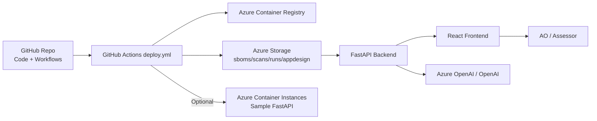

# SWFT Authorization Portal – Application Design

> The AI assistant ingests this entire document. Keep it current so Authorizing Officials (AOs) and engineers receive decisions grounded in the latest architecture, controls, and operations.

---

## 1. Mission Objectives
- Deliver a single-pane portal where DoD SWFT programs can stream build evidence (SBOM, Trivy, Cosign, run manifests) within minutes of a GitHub Actions run.
- Shorten AO review cycles by pairing live evidence with an AI co-pilot that is grounded on architecture intent (`app-design.md`) and pipeline telemetry.
- Prove “code low, deploy high” by keeping development at IL2 (GitHub.com) while promoting signed artefacts into IL4/IL5 landing zones hosted on Azure.
- Maintain a lightweight footprint (GitHub, Azure Storage, Azure Container Instances, Azure OpenAI) so new programs can replicate the pattern without bespoke tooling.

## 2. System Overview
- **Frontend (`frontend/`)** – React + Vite SPA served as static assets. It calls the backend API for run summaries, artefact downloads, and assistant chats. Tailwind, Nivo, and Headless UI drive the UX.
- **Backend (`backend/`)** – FastAPI service that:
  - Indexes run artefacts directly from Azure Blob Storage (or a local mirror for dev).
  - Normalises metadata (cosign status, SBOM size, Trivy fail set) for dashboards.
  - Hosts the assistant endpoints, injecting model schemas and `app-design.md`.
  - Provides signed download links for SBOM/Trivy/run/app-design blobs.
- **CI/CD (`.github/workflows/deploy.yml`)** – GitHub Actions pipeline triggered by pushes or manual dispatch. For each target container (sample FastAPI, backend, frontend) it:
  1. Builds and pushes the image to Azure Container Registry (ACR).
  2. Pulls the digest, signs it with Cosign, and verifies the signature.
  3. Generates SBOM (Syft), runs Trivy, captures scanner metadata, and emits SARIF.
  4. Uploads fixed-name artefacts (`sbom.cyclonedx.json`, `trivy-report.json`, `run.json`, `app-design.md`) to Azure Storage and optionally GitHub artifacts.
  5. Deploys the FastAPI demo container to Azure Container Instances when flagged.
- **Evidence Store** – Azure Storage account with containers `sboms`, `scans`, `runs`, `appdesign`. Artefact names follow `<project>-<target>-<runId>-<type>.json` so the backend can derive project/run IDs.
- **Assistant Stack** – Frontend streams to `POST /assistant/chat/stream`. Backend calls Azure OpenAI or OpenAI Responses API using models defined in `backend/app/assistant/model_config.json`. Every request bundles the run manifest plus facet-specific evidence.
- **Hosting** – Portal can be containerised and run on Azure Container Apps/ACI; sample pipeline deploys the FastAPI demo image to show end-to-end traceability.

## 3. Component Glossary

| Component | Owner | Description | Critical Dependencies |
|-----------|-------|-------------|-----------------------|
| `frontend/` | UX + DevSecOps | React SPA for dashboards, evidence viewers, and assistant drawer. | Backend API, Tailwind, Vite, Azure Storage (through backend). |
| `backend/` | Platform Team | FastAPI API + assistant service. Reads Azure Blob Storage for artefacts, enforces caching, exposes `/assistant` endpoints. | Azure Storage (SAS or MI), Azure/OpenAI credentials, Redis-like cache (in-memory default). |
| Azure Storage account | Cloud Ops | Durable evidence store with containers: `runs`, `sboms`, `scans`, `appdesign`. | Azure RBAC, encryption-at-rest (Microsoft-managed keys), network rules. |
| `.github/workflows/deploy.yml` | DevSecOps | Build/sign/scan/upload workflow for each container target. | GitHub Actions runners, Cosign keys, ACR, Syft, Trivy. |
| Azure Container Registry | Cloud Ops | Hosts Digests signed by Cosign, consumed by Trivy and deployments. | Managed identity / SP credentials, Cosign public key for verification. |
| Azure Container Instances (demo) | Platform Team | Runs sample FastAPI workload to prove “build low/deploy high”. | ACR pull permission, Azure login in workflow. |
| Azure OpenAI / OpenAI | AI Platform | Provides GPT-4/5-family models for assistant personas. | API keys, model deployments, `model_config.json`. |

## 4. Evidence Catalogue
- **SBOM (CycloneDX JSON)** – Generated by `anchore/sbom-action@v0.20.1` against the pushed image. Uploaded as `<prefix>-sbom.json` into `sboms`.
- **Trivy report** – `aquasecurity/trivy-action` scans the image with credentialed pull from ACR. JSON goes to `scans`, SARIF retained for CodeQL UI. Metadata (scan/fail severities, DB updated time) captured for dashboards.
- **Run manifest (`run.json`)** – Custom step capturing commit, workflow URL, cosign verify status, Trivy policy, deployment URL, timestamps, and file references. Drives the backend summaries.
- **Cosign signature** – Stored in ACR as OCI artefact; run manifest records verify status. Failing verification can optionally break the workflow.
- **app-design.md snapshot** – Workflow uploads the current document so each run’s architecture intent is preserved.
- **Retention & Security** – Azure Storage lifecycle policies keep 90 days of per-run artefacts by default; containers are private with Azure AD RBAC. Access limited to the backend’s managed identity or connection string.

## 5. Control Mapping (examples)
- **AC-17 / IA-2** – GitHub Actions OIDC + Azure login ensures federated authentication into Azure without static secrets.
- **CM-2 / CM-3** – `run.json` plus SBOM/Trivy attest component inventory per build, enabling configuration/change tracking.
- **SI-7 / RA-5** – Trivy findings feed dashboards; fail sets can enforce break-glass policies via `fail_on_trivy` input.
- **SC-13 / SC-28** – Artefacts encrypted at rest in Azure Storage; Cosign signatures protect integrity in transit.
- **CA-2 / CA-7** – Portal + assistant give AOs continuous monitoring data (cosign status, scan health, deployment URLs).

Inherited controls include GitHub Enterprise SaaS baselines, Azure platform encryption, and Azure OpenAI boundary protections.

## 6. Auto-Context Hints for the Assistant
- Always include the run manifest so personas can reference cosign/trivy policy outcomes and deployment metadata.
- SBOM JSON is only attached when the SBOM facet is active to avoid unnecessary truncation; highlight `metadata.components` and `licenses`.
- Trivy facet includes severity histograms plus scanner metadata—call out `assessment.trivy` fields when summarising policy posture.
- Architecture facet injects this `app-design.md` snapshot; mention environment matrix and known risks when users ask about accreditation.
- The general facet excludes SBOM for brevity but still receives Trivy + app-design context; remind users to open raw SBOM modal if counts look truncated.
- If `COSIGN_VERIFY_STATUS=failed`, emphasise remediation steps (rotate keys, re-run workflow) before authorisation proceeds.

## 7. Operational Playbooks
1. **Failed Cosign verification** – Inspect workflow logs, confirm base64 keys, and re-run with `fail_on_cosign_verify=true` once corrected. If signatures still fail, quarantine the image in ACR.
2. **Critical Trivy findings** – Backend highlights fail-set counts; open the raw report via the UI, create remediation tickets, and re-run the pipeline after patching. AO can defer approval until fail set returns to zero.
3. **Missing artefacts** – If SBOM/Trivy blobs absent, confirm workflow upload toggles and Azure Storage RBAC. Backend logs show container access errors.
4. **Assistant outage** – Backend logs `OpenAI` errors; rotate API keys or lower history depth. Frontend surfaces fallback guidance.
5. **Rollbacks** – Redeploy previous digest from ACR (verified via Cosign). Update run manifest with rollback metadata for traceability.

## 8. Environment Matrix

| Environment | Hosting | Data Classification | AuthN/AuthZ notes | Change Window |
|-------------|---------|---------------------|-------------------|---------------|
| IL2 Dev | GitHub Actions + Azure Storage (dev containers) | Controlled Unclassified (Development) | GitHub OIDC into Azure; RBAC-scoped storage access | Daily 08:00‑18:00 ET |
| IL4 Staging | Azure Govt Subscription (ACI/ACA) | IL4 | Managed identity for storage + ACR, Azure AD conditional access | Tue/Thu 09:00‑17:00 ET |
| IL5 Production | Azure Govt Landing Zone | IL5 | Dedicated managed identities, private endpoints, AO-approved change board | Thurs 13:00‑17:00 ET or emergency CAB |

## 9. Architecture Decisions & Risks
- **ADR-001 Build once, deploy high** – Single GitHub workflow produces artefacts for all environments; risk: IL5 consumers must trust IL2 pipeline controls (mitigated via Cosign + SBOM uploads).
- **ADR-002 Evidence in flat storage** – Azure Blob containers retain canonical artefacts without additional services; risk: lack of relational queries (mitigated by FastAPI caching and naming conventions).
- **ADR-003 Assistant grounding** – Rely on `app-design.md` + schemas instead of RAG DB; risk: stale documentation can mislead answers (mitigated by required updates every release).
- **Open risk** – AI assistant payloads can exceed model context when SBOMs are massive; mitigated by client-side minification and facet-specific limits, but teams should consider summarising SBOMs server-side for very large images.
- **Backlog** – Add automated drift detection across runs (component deltas, cosign failures) and support for additional artefacts (CodeQL SARIF ingestion).

## 10. CVEs Fixed
| CVE              | Component (Package) | Installed Version           | Fixed Version            |
|------------------|---------------------|-----------------------------|---------------------------|
| CVE-2025-4802    | libc-bin            | 2.36-9+deb12u10             | 2.36-9+deb12u11          |
| CVE-2025-4802    | libc6               | 2.36-9+deb12u10             | 2.36-9+deb12u11          |
| CVE-2023-52425   | libexpat1           | 2.5.0-1+deb12u1             | 2.5.0-1+deb12u2          |
| CVE-2024-8176    | libexpat1           | 2.5.0-1+deb12u1             | 2.5.0-1+deb12u2          |
| CVE-2025-32988   | libgnutls30         | 3.7.9-2+deb12u4             | 3.7.9-2+deb12u5          |
| CVE-2025-32990   | libgnutls30         | 3.7.9-2+deb12u4             | 3.7.9-2+deb12u5          |
| CVE-2025-5222    | libicu72            | 72.1-3                      | 72.1-3+deb12u1           |
| CVE-2025-9900    | libtiff6            | 4.5.0-6+deb12u2             | 4.5.0-6+deb12u3          |
| CVE-2024-56171   | libxml2             | 2.9.14+dfsg-1.3~deb12u1     | 2.9.14+dfsg-1.3~deb12u2  |
| CVE-2025-49794   | libxml2             | 2.9.14+dfsg-1.3~deb12u1     | 2.9.14+dfsg-1.3~deb12u3  |
| CVE-2025-49796   | libxml2             | 2.9.14+dfsg-1.3~deb12u1     | 2.9.14+dfsg-1.3~deb12u3  |
| CVE-2022-49043   | libxml2             | 2.9.14+dfsg-1.3~deb12u1     | 2.9.14+dfsg-1.3~deb12u2  |
| CVE-2024-25062   | libxml2             | 2.9.14+dfsg-1.3~deb12u1     | 2.9.14+dfsg-1.3~deb12u2  |
| CVE-2025-24928   | libxml2             | 2.9.14+dfsg-1.3~deb12u1     | 2.9.14+dfsg-1.3~deb12u2  |
| CVE-2025-27113   | libxml2             | 2.9.14+dfsg-1.3~deb12u1     | 2.9.14+dfsg-1.3~deb12u2  |
| CVE-2025-32414   | libxml2             | 2.9.14+dfsg-1.3~deb12u1     | 2.9.14+dfsg-1.3~deb12u2  |
| CVE-2025-32415   | libxml2             | 2.9.14+dfsg-1.3~deb12u1     | 2.9.14+dfsg-1.3~deb12u2  |
| CVE-2025-6021    | libxml2             | 2.9.14+dfsg-1.3~deb12u1     | 2.9.14+dfsg-1.3~deb12u3  |
| CVE-2025-7424    | libxslt1.1          | 1.1.35-1+deb12u1            | 1.1.35-1+deb12u2         |
| CVE-2023-31484   | perl-base           | 5.36.0-7+deb12u2            | 5.36.0-7+deb12u3         |

### Method
Modifed Dockerfile to pull latest security patches:

  - libxml2 
  - libexpat1 
  - libgnutls30 
  - libc-bin 
  - libc6 
  - libicu72 
  - libxslt1.1 
  - libtiff6 
  - libkrb5-3 
  - libkrb5support0 
  - libgssapi-krb5-2 
  - openssl 
  - libssl3 
  - perl-base 

### Recent Remediations
| Date | Finding / Risk | Fix Applied | Code Change | Evidence |
|------|----------------|-------------|-------------|----------|
| 2025-11-11 | OS package CVEs (libxml2, libexpat1, libgnutls30, libc6, libicu72, libxslt1.1, libtiff6, krb5, openssl, perl-base) | Pulled patched Debian packages during image build | `backend/Dockerfile`, `frontend/Dockerfile` | CVEs Fixed table + Trivy report package versions |
| 2025-12-15 | Frontend dependency alerts | Lockfile updated to newer package versions | `frontend/package-lock.json` | `run.json` commitSha + lockfile diff + Trivy findings delta |
| 2026-02-24 | **azure-core** – Deserialization of untrusted data (Dependabot #19); upgraded v1.36.0 → v1.38.2 | `uv lock --upgrade-package azure-core` | `uv.lock` | Dependabot alert #19 closed |
| 2026-02-24 | **urllib3** – Decompression-bomb safeguards bypassed via HTTP redirects; unbounded decompression chain links; streaming API improperly handles highly compressed data (Dependabot #16, #17, #18); upgraded v2.5.0 → v2.6.3 | `uv lock --upgrade-package urllib3` | `uv.lock` | Dependabot alerts #16, #17, #18 closed |
| 2026-02-24 | **python-multipart** – Arbitrary file write via non-default configuration (Dependabot #21); upgraded v0.0.20 → v0.0.22 | `uv lock --upgrade-package python-multipart` | `uv.lock` | Dependabot alert #21 closed |
| 2026-02-24 | **cryptography** – Subgroup attack due to missing subgroup validation for SECT curves (Dependabot #22); upgraded v46.0.3 → v46.0.5 | `uv lock --upgrade-package cryptography` | `uv.lock` | Dependabot alert #22 closed |
| 2026-02-24 | **starlette** – O(n²) DoS via Range header merging in `FileResponse`; second starlette alert (Dependabot #15); upgraded v0.46.2 → v0.49.3 | `uv lock --upgrade-package starlette` | `uv.lock` | Dependabot alert #15 closed |
| 2026-02-24 | **Trivy scanner** – Updated from v0.67.2 → v0.69.0 to pick up latest vulnerability DB and scanner improvements | Updated `version` field in both Trivy workflow steps | `.github/workflows/deploy.yml` | Trivy release notes v0.69.x |

### Demo Questions the Assistant Can Answer
- "Which commit fixed the libxml2 CVEs and how was it done?"
- "Show me where we updated npm dependencies to remediate alerts."
- "Why did the Trivy fail-set drop to zero in the last run, and what code change caused it?"

## 12. Change Log

| Date | Change | Author |
|------|--------|--------|
| 2026-02-24 | Resolved 6 Dependabot alerts: azure-core→1.38.2, urllib3→2.6.3 (3 alerts), python-multipart→0.0.22, cryptography→46.0.5, starlette→0.49.3; bumped Trivy to v0.69.0. | Dev Team |
| 2025-12-19 | Added remediation evidence trail for assistant demos. | Dev Team |
| 2025-11-11 | Updated CVEs Fixed | Dev Team |
| 2025-11-11 | Replaced template with SWFT-specific architecture, controls, and assistant guidance. | Platform Team |
| 2025-11-01 | Initial outline committed to support AO assistant conversations. | Platform Team |
