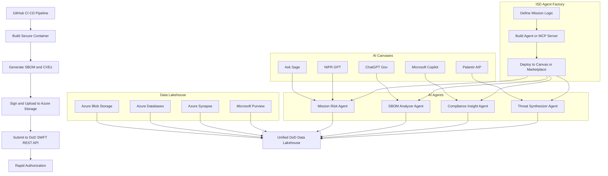
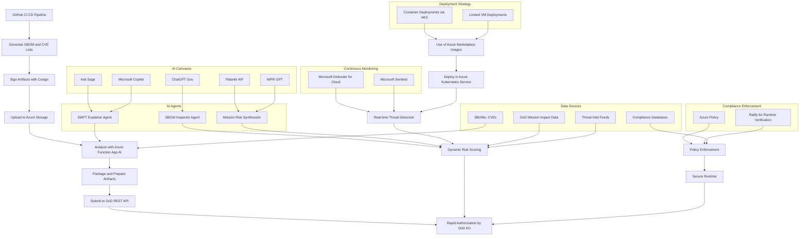
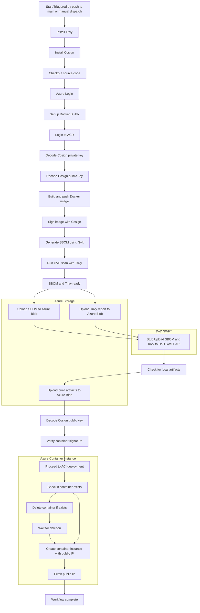

### High Level Ovrerview of DoD AI Apps and MSFT Plugins



### Mermaid Diagram


## SWFT Pipeline Diagram




## SWFT App

First we need to create the Azure resources

```bash
# Login to Azure
az login

# Create resource group
az group create --name demo-swft-cicd --location eastus

# Create an Azure Container Registry (ACR)
az acr create --resource-group demo-swft-cicd --name swftacr$RANDOM --sku Basic

# Create a Storage Account for SBOMs
az storage account create --name swftsbomstore$RANDOM --resource-group demo-swft-cicd --location eastus --sku Standard_LRS

# (Optional) Create a blob container for SBOMs
az storage container create --account-name <storage_account_name> --name sboms

# Create a Service Principal for GitHub Actions
az ad sp create-for-rbac --name "swft-cicd-sp" --role contributor \
  --scopes /subscriptions/<SUBSCRIPTION_ID>/resourceGroups/demo-swft-cicd \
  --sdk-auth


```

#### Github Secrets
```markdown
| Secret Name             | How to Create/Get                                            |
| ----------------------- | ------------------------------------------------------------ |
| AZURE\_CLIENT\_ID       | From your Azure Service Principal                            |
| AZURE\_TENANT\_ID       | From your Azure Active Directory                             |
| AZURE\_SUBSCRIPTION\_ID | From your Azure Portal                                       |
| AZURE\_CLIENT\_SECRET   | From your Azure Service Principal                            |
| ACR\_LOGIN\_SERVER      | From `az acr show ... --query loginServer`                   |
| ACR\_USERNAME           | From `az acr credential show ... --query username`           |
| ACR\_PASSWORD           | From `az acr credential show ... --query passwords[0].value` |
| AZURE\_STORAGE\_ACCOUNT | Your storage account name                                    |
| AZURE\_STORAGE\_KEY     | From `az storage account keys list ...`                      |


```

#### Integrated Security Best Practices

- Base Images: Use FIPS-compatible images (e.g., Chainguard Wolfi).

- SBOM Format: Use SPDX or CycloneDX.

- Policy as Code: Enforce compliance using Azure Policy and OPA/Gatekeeper with Ratify.

- Runtime Controls: Reject unsigned or policy-violating containers during AKS admission.


### SWFT CICD Pipeline
Overview of Pipeline Phases

```markdown
| **Phase**             | **Description**                                     | **Tools/Integrations**                                     | **SWFT RFI Mapping** |
| --------------------- | --------------------------------------------------- | ---------------------------------------------------------- | -------------------- |
| 1. Checkout           | Pull latest code from GitHub repo                   | `actions/checkout@v3`                                      | -                    |
| 2. Build Container    | Build container image using hardened base           | `docker build`, Wolfi/Chainguard, Azure Marketplace images | Tools Q1, Q2         |
| 3. Generate SBOM      | Output full SBOM with license and component details | `anchore/sbom-action`, `cyclonedx-github-action`           | Tools Q3             |
| 4. CVE Scan           | Scan for known vulnerabilities                      | `aquasecurity/trivy-action`, or `github/codeql-action`     | AI Q1, Tools Q4      |
| 5. Sign Image         | Sign container image and SBOM                       | `sigstore/cosign-installer`, `cosign sign`                 | External Q5          |
| 6. Push to Registry   | Push to ACR (Azure Container Registry)              | `docker push`, `az acr login`                              | -                    |
| 7. Upload SBOM        | Upload SBOM to Azure Storage for pipeline tracking  | `azure/CLI`, `az storage blob upload`                      | Tools Q5, Q6         |
| 8. Submit to SWFT API | Submit artifact metadata for SWFT risk decision     | Azure Function or REST Client                              | AI Q1, Q3            |
| 9. Deployment         | Deploy to AKS with runtime policy enforcement       | GitHub Deployments + Ratify + Gatekeeper                   | Tools Q4, AI Q4      |
| 10. Monitoring        | Continuously monitor deployed containers            | Microsoft Defender for Cloud, Microsoft Sentinel           | AI Q1, Q2            |
| 11. Rescan            | Periodic rescan of registry images                  | `schedule:` + Azure Defender or Trivy in cron              | Tools Q4             |
| 12. Artifact Logs     | Upload logs for audit                               | `actions/upload-artifact@v3`                               | External Q5          |
```


#### Workflow Steps

```github-workflow
name: SWFT Container CI/CD

on:
  push:
    branches: [ main ]
  workflow_dispatch:

permissions:
  contents: read
  id-token: write

env:
  ACR_LOGIN_SERVER:    ${{ secrets.ACR_LOGIN_SERVER }}
  ACR_USERNAME:        ${{ secrets.ACR_USERNAME }}
  ACR_PASSWORD:        ${{ secrets.ACR_PASSWORD }}
  IMAGE_NAME:          fastapi-demo
  IMAGE_TAG:           ${{ github.sha }}
  AZURE_RESOURCE_GROUP: demo-swft-cicd
  AZURE_CONTAINER_NAME: swft-fastapi
  AZURE_STORAGE_ACCOUNT: ${{ secrets.AZURE_STORAGE_ACCOUNT }}
  AZURE_STORAGE_KEY:     ${{ secrets.AZURE_STORAGE_KEY }}

jobs:
  build-and-deploy:
    runs-on: ubuntu-latest

    steps:
      - name: Install Trivy
        uses: aquasecurity/setup-trivy@v0.2.1

      - name: Checkout source
        uses: actions/checkout@v3

      - name: Azure Login
        uses: azure/login@v1
        with:
          creds: ${{ secrets.AZURE_CREDENTIALS }}

      - name: Set up Docker Buildx
        uses: docker/setup-buildx-action@v3

      - name: Log in to ACR
        run: |
          echo "$ACR_PASSWORD" \
            | docker login "$ACR_LOGIN_SERVER" \
                          -u "$ACR_USERNAME" \
                          --password-stdin

      - name: Build Docker image
        run: |
          docker buildx build \
            -t "$ACR_LOGIN_SERVER/$IMAGE_NAME:$IMAGE_TAG" \
            --push \
            .

      - name: Generate SBOM (Syft)
        uses: anchore/sbom-action@v0.20.1
        with:
          image:        ${{ env.ACR_LOGIN_SERVER }}/${{ env.IMAGE_NAME }}:${{ env.IMAGE_TAG }}
          format:       cyclonedx-json
          output-file:  sbom.cyclonedx.json
          upload-artifact: false

      - name: CVE Scan and save report (Trivy)
        run: |
          trivy image \
            --format json \
            --output trivy-report.json \
            --severity HIGH,CRITICAL \
            --ignore-unfixed \
            "$ACR_LOGIN_SERVER/$IMAGE_NAME:$IMAGE_TAG"


      - name: Upload SBOM to Azure Storage
        env:
          AZURE_STORAGE_ACCOUNT: ${{ secrets.AZURE_STORAGE_ACCOUNT }}
          AZURE_STORAGE_KEY: ${{ secrets.AZURE_STORAGE_KEY }}
          IMAGE_NAME: ${{ env.IMAGE_NAME }}
          IMAGE_TAG: ${{ env.IMAGE_TAG }}
        run: |
          az storage blob upload \
            --auth-mode key \
            --account-name "$AZURE_STORAGE_ACCOUNT" \
            --account-key  "$AZURE_STORAGE_KEY" \
            --container-name sboms \
            --file           sbom.cyclonedx.json \
            --name           "${IMAGE_NAME}-${IMAGE_TAG}-sbom.json" \
            --overwrite


      - name: Upload Trivy report to Azure Storage
        env:
          AZURE_STORAGE_ACCOUNT: ${{ secrets.AZURE_STORAGE_ACCOUNT }}
          AZURE_STORAGE_KEY: ${{ secrets.AZURE_STORAGE_KEY }}
          IMAGE_NAME: ${{ env.IMAGE_NAME }}
          IMAGE_TAG: ${{ env.IMAGE_TAG }}
        run: |
          az storage blob upload \
            --auth-mode key \
            --account-name "$AZURE_STORAGE_ACCOUNT" \
            --account-key  "$AZURE_STORAGE_KEY" \
            --container-name scans \
            --file           trivy-report.json \
            --name           "${IMAGE_NAME}-${IMAGE_TAG}-trivy.json" \
            --overwrite


      - name: Upload SBOM to DoD SWFT REST API (stubbed)
        run: |
          echo "🟡 STUB: Would POST SBOM to DoD SWFT API"
          echo "Endpoint: https://api.swft.dod.mil/v1/sboms"
          echo "Auth: Bearer ${{ secrets.DO_D_SWFT_API_TOKEN }}"
          echo "Payload: ${{ env.IMAGE_NAME }}-${{ env.IMAGE_TAG }}"


      - name: Upload all artifacts to Azure Blob Storage
        uses: azure/CLI@v2
        env:
          AZURE_STORAGE_ACCOUNT: ${{ secrets.AZURE_STORAGE_ACCOUNT }}
          AZURE_STORAGE_KEY: ${{ secrets.AZURE_STORAGE_KEY }}
          IMAGE_TAG: ${{ env.IMAGE_TAG }}
        with:
          inlineScript: |
            az storage container create \
              --account-name "$AZURE_STORAGE_ACCOUNT" \
              --account-key  "$AZURE_STORAGE_KEY" \
              --name         artifacts \
              --public-access off

            if compgen -G "./artifacts/*" > /dev/null; then
              for file in ./artifacts/*; do
                filename=$(basename "$file")
                echo "Uploading $filename..."
                az storage blob upload \
                  --account-name   "$AZURE_STORAGE_ACCOUNT" \
                  --account-key    "$AZURE_STORAGE_KEY" \
                  --container-name artifacts \
                  --file           "$file" \
                  --name           "${IMAGE_TAG}-${filename}"
              done
            else
              echo "No files found in ./artifacts/ — skipping upload."
            fi

      - name: Deploy to Azure Container Instance
        shell: bash
        env:
          AZURE_RESOURCE_GROUP: ${{ secrets.AZURE_RESOURCE_GROUP }}
          AZURE_CONTAINER_NAME: ${{ env.AZURE_CONTAINER_NAME }}
          ACR_LOGIN_SERVER:     ${{ env.ACR_LOGIN_SERVER }}
          ACR_USERNAME:         ${{ secrets.ACR_USERNAME }}
          ACR_PASSWORD:         ${{ secrets.ACR_PASSWORD }}
          IMAGE_NAME:           ${{ env.IMAGE_NAME }}
          IMAGE_TAG:            ${{ env.IMAGE_TAG }}
        run: |
          echo "Checking if container instance exists..."
          if az container show \
              --resource-group "$AZURE_RESOURCE_GROUP" \
              --name "$AZURE_CONTAINER_NAME" \
              --only-show-errors \
              --output none 2>/dev/null; then
            echo "Container exists. Deleting and recreating..."
            az container delete \
              --resource-group "$AZURE_RESOURCE_GROUP" \
              --name "$AZURE_CONTAINER_NAME" \
              --yes

            echo "Waiting for container deletion..."
            for i in {1..30}; do
              if ! az container show --resource-group "$AZURE_RESOURCE_GROUP" --name "$AZURE_CONTAINER_NAME" &>/dev/null; then
                echo "✅ Container deleted."
                break
              fi
              echo "... Still deleting... retry $i"
              sleep 5
            done
          else
            echo "Container does not exist. Creating..."
          fi

          echo "Creating container instance..."
          az container create \
            --resource-group "$AZURE_RESOURCE_GROUP" \
            --name "$AZURE_CONTAINER_NAME" \
            --image "$ACR_LOGIN_SERVER/$IMAGE_NAME:$IMAGE_TAG" \
            --registry-login-server "$ACR_LOGIN_SERVER" \
            --registry-username     "$ACR_USERNAME" \
            --registry-password     "$ACR_PASSWORD" \
            --cpu 1 --memory 1 \
            --os-type Linux \
            --ports 80 \
            --ip-address Public

          echo "Fetching container public IP..."
          PUBLIC_IP=$(az container show \
            --resource-group "$AZURE_RESOURCE_GROUP" \
            --name "$AZURE_CONTAINER_NAME" \
            --query "ipAddress.ip" -o tsv)

          echo "✅ Container is deployed and accessible at: http://$PUBLIC_IP"

```


<!-- @import "[TOC]" {cmd="toc" depthFrom=1 depthTo=6 orderedList=false} -->
